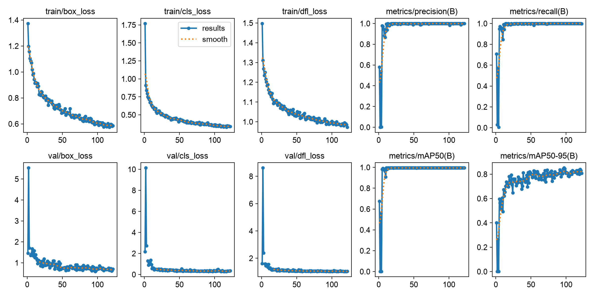

<div align="center">

# 🛂 Passport-OCR-YOLO


**MRZ detection with YOLO · ICAO 9303 parsing · structured JSON output with Tesseract + OCR-B**

An end-to-end pipeline that detects the **MRZ (Machine Readable Zone)** on passports and
ID documents with YOLO, reads and parses that region with **Tesseract + OCR-B**, and exports
the results as a clean **JSON** structure.

<p>
  
  
  
  
  
</p>

</div>

---

## 📌 Project Purpose

This project performs **automated data extraction** from images of passports and travel documents:

1. **🔍 Detection** — A YOLO model detects and crops the **MRZ** region on the document.
2. **🔤 OCR (Tesseract + OCR-B)** — The cropped MRZ region is read with an MRZ-specific **OCR-B** model.
3. **🧩 Parsing & Output** — MRZ lines are parsed per ICAO 9303, validated, and saved as **structured JSON**.

```text
   ┌──────────┐     ┌──────────┐     ┌──────────────┐     ┌──────────┐
   │   Image  │ ──▶ │   YOLO   │ ──▶ │  Tesseract   │ ──▶ │   MRZ    │ ──▶  📄 JSON
   │ (Passport)│    │ Detection│     │   + OCR-B    │     │  Parsing │
   └──────────┘     └──────────┘     └──────────────┘     └──────────┘
```

---

## ✨ Features

- 🎯 **YOLO-based MRZ detection** — locates the MRZ region on a passport/ID quickly and accurately.
- 🔤 **Tesseract + OCR-B** — MRZ-specific OCR-B model; **0% character error rate** on synthetic MRZ.
- 🧠 **ICAO 9303 MRZ parsing** — field extraction supporting the TD1 / TD2 / TD3 formats.
- ✅ **Checksum validation** — field-accuracy checks against MRZ check digits, with automatic repair.
- 🛠️ **Positional repair** — fixes OCR errors using class constraints (date→digit, country code→letter).
- 📊 **Reliability score** — a `reliability_score` calibrated from ground truth (logistic regression, AUC 0.92); low-confidence reads are automatically routed to manual review.
- 🎯 **Per-field reliability** — each field carries its own `reliability` value, grounded in its historical accuracy measured from GT.
- 📦 **Structured JSON output** — country, names, document code, dates, and validity status.
- 🗃️ **SQLite reference database** — for matching country and document information.

---

## 🗂️ Project Structure

```text
Passport-OCR-YOLO/
├── Scripts/
│   ├── detection/          # MRZ detection
│   │   ├── detect.py       #   MRZ region detection with YOLO
│   │   └── preprocess.py   #   image cropping / deskew / contrast
│   ├── ocr/                # Tesseract + OCR-B OCR engine
│   │   ├── engine.py       #   OCR-B reading (--oem 1 --psm 6)
│   │   ├── pipeline.py     #   detection → OCR → line selection → parsing pipeline
│   │   ├── setup_model.py  #   ocrb.traineddata downloader
│   │   └── tessdata/       #   OCR-B model
│   ├── parsing/            # MRZ parsing & output
│   │   ├── mrz_parse.py    #   ICAO 9303 parsing + check-digit repair
│   │   ├── reconstruct.py  #   line alignment & validation scoring
│   │   ├── schema.py       #   structured JSON output + reliability score
│   │   ├── schema_helpers.py
│   │   └── country_lookup.py
│   └── YOLO/               # YOLO model weights + training notebook
├── GroundTruth/            # Manually verified GT + accuracy/calibration tools
│   ├── ground_truth.json
│   ├── evaluate.py         #   CER + field-accuracy measurement
│   └── calibrate.py        #   reliability-score weight calibration
├── tests/                  # MRZ parsing acceptance tests
├── Images/                 # Image data (not included in git)
│   ├── MRZ_Data/
│   └── Outputs/
├── SQL/
│   └── europa_data.db      # Reference database (country / document info)
├── main_tess.py            # Tesseract + OCR-B CLI entry point
├── .gitignore
├── .gitattributes
└── README.md
```

> ℹ️ `Images/`, model weights (`*.pt`, `*.onnx`), and `runs/` outputs are kept out of the repo via `.gitignore`.

---

## 📈 Model Performance

The YOLO detector is trained on a labelled MRZ dataset; the curves below show loss decreasing
and precision/recall/mAP climbing steadily over training — a clean, well-converged run.



End-to-end OCR accuracy, measured against a hand-verified ground truth of **168 documents**
(each passed through the full detection → OCR → parse pipeline):

| Metric                | Value         |
|-----------------------|---------------|
| Character accuracy    | **98.30%**    |
| Field accuracy        | **96.94%**    |
| All fields correct    | **146 / 168** |

---

## 📊 Reliability Scoring

Every result carries a `reliability_score` — the model's own estimate of how much to trust the
read. Instead of hand-tuned weights, the score is a **logistic-regression model calibrated from
ground truth**: it learns which signals actually predict a correct read.

```text
reliability = sigmoid( 29.51 · mean_field_reliability
                     + 10.47 · structural_fraction
                     − 35.98 )
```

| Property                      | Value     |
|-------------------------------|-----------|
| Out-of-fold AUC               | **0.915** |
| Brier score                   | 0.119     |
| Decision threshold            | 0.75      |
| Error recall at threshold     | **100%**  |

Reads below the 0.75 threshold are flagged `rescan_recommended` and routed to manual review,
so **no incorrect read slips through silently** — the threshold catches every error in the
ground-truth set while keeping false alarms low.

---

## 🚀 Installation

```bash
# Clone the repository
git clone <repo-url>
cd Passport-OCR-YOLO

# Create a virtual environment
python -m venv .venv
# Windows
.venv\Scripts\activate
# Linux / macOS
source .venv/bin/activate

# Install dependencies
pip install -r requirements.txt
```

**Recommended dependencies:** `ultralytics`, `opencv-python`, `pytesseract`, `numpy`, `pandas`.

> 🔧 [Tesseract OCR](https://github.com/tesseract-ocr/tesseract) must be installed on the system
> (default Windows path: `C:\Program Files\Tesseract-OCR\tesseract.exe`).

```bash
# Download the MRZ-specific OCR-B model (ocrb.traineddata) — one time only
python main_tess.py setup
```

---

## 🧪 Usage

```bash
# Process a single image
python main_tess.py image "Images/MRZ_Data/images/2dfa28dd-TUR-AO-02001_265357.jpg"

# Write the output to a specific folder
python main_tess.py image "<image path>" --output-dir "Images/Outputs"
```

Two files are produced for each processed image:
`<name>_tess_annotated.jpg` (image with the MRZ box drawn) and `<name>_tess_ocr.json` (parsed data).

### Example Result


Each field carries its own **`reliability`** value — the field's historical accuracy measured
from ground truth, modulated by that document's live signals (check digit, OCR confidence).
`quality.reliability_score` is the document's overall reliability.

```json
{
  "document": {
    "type": { "code": "P", "description": "Passport" },
    "number": { "value": "ZD000078", "reliability": 0.95 },
    "personal_number": { "value": "00000000000", "reliability": 0.95 },
    "mrz_format": "TD3"
  },
  "holder": {
    "surname": { "value": "MARTIN", "reliability": 0.89 },
    "given_names": { "value": "SARAH", "reliability": 0.89 },
    "given_names_list": ["SARAH"],
    "full_name": "SARAH MARTIN",
    "nationality": { "code": "CAN", "name": "Canada", "reliability": 0.97 },
    "sex": { "code": "F", "description": "Female", "reliability": 0.95 }
  },
  "dates": {
    "date_of_birth": { "raw": "850101", "iso": "1985-01-01", "reliability": 0.97 },
    "date_of_expiry": { "raw": "180114", "iso": "2018-01-14", "reliability": 0.96 },
    "is_expired": true
  },
  "validation": {
    "mrz_overall_valid": true,
    "failed_checks": [],
    "auto_repaired_fields": []
  },
  "quality": {
    "reliability_score": 0.92,
    "rescan_recommended": false
  },
  "warnings": ["document_expired"],
  "raw_mrz": [
    "P<CANMARTIN<<SARAH<<<<<<<<<<<<<<<<<<<<<<<<<<",
    "ZD000078<7CAN8501019F1801145<<<<<<<<<<<<<<04"
  ]
}
```

---

## 🔄 Processing Flow

| Step | Component             | Task                                                          |
|------|-----------------------|---------------------------------------------------------------|
| 1️⃣  | **YOLO**              | Detects and crops the MRZ region in the document image.       |
| 2️⃣  | **Tesseract + OCR-B** | Reads the characters in the cropped MRZ region with OCR-B.    |
| 3️⃣  | **Parser**            | Splits the MRZ lines into fields per ICAO 9303.               |
| 4️⃣  | **Validator**         | Validates with check digits and computes the reliability score.|
| 5️⃣  | **Export**            | Saves the results as structured JSON.                         |

---

## 🤝 Contributing

Contributions are welcome! Please open an `issue` or submit a `pull request`.

## 📄 License

This project is licensed under the **MIT License**.
