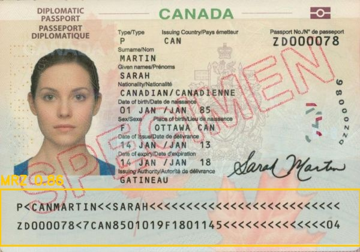

<div align="center">

# 🛂 Passport-OCR-YOLO


**YOLO ile MRZ tespiti · ICAO 9303 çözümleme · Tesseract + OCR-B ile yapılandırılmış JSON çıktısı**

Pasaport ve kimlik belgelerindeki **MRZ (Machine Readable Zone)** bölgesini YOLO ile tespit eden,
bu bölgeyi **Tesseract + OCR-B** ile okuyup çözümleyen ve sonuçları temiz bir **JSON** yapısına
aktaran uçtan uca bir hat.

<p>
  
  
  
  
  
</p>

</div>

---

## 📌 Proje Amacı

Bu proje, pasaport ve seyahat belgelerinin görüntülerinden **otomatik veri çıkarımı** yapar:

1. **🔍 Tespit (Detection)** — YOLO modeli, belge üzerindeki **MRZ** bölgesini tespit eder ve kırpar.
2. **🔤 OCR (Tesseract + OCR-B)** — Kırpılan MRZ bölgesi, MRZ'ye özel eğitilmiş **OCR-B** modeliyle okunur.
3. **🧩 Çözümleme & Çıktı** — MRZ satırları ICAO 9303'e göre çözülür, doğrulanır ve **yapılandırılmış JSON** olarak kaydedilir.

```text
   ┌──────────┐     ┌──────────┐     ┌──────────────┐     ┌──────────┐
   │  Görüntü │ ──▶ │   YOLO   │ ──▶ │  Tesseract   │ ──▶ │   MRZ    │ ──▶  📄 JSON
   │ (Passport)│    │ Tespiti  │     │   + OCR-B    │     │ Çözümleme│
   └──────────┘     └──────────┘     └──────────────┘     └──────────┘
```

---

## ✨ Özellikler

- 🎯 **YOLO tabanlı MRZ tespiti** — pasaport/kimlik üzerindeki MRZ bölgesini hızlı ve doğru biçimde bulur.
- 🔤 **Tesseract + OCR-B** — MRZ'ye özel eğitilmiş OCR-B modeli; sentetik MRZ'de **%0 karakter hata oranı**.
- 🧠 **ICAO 9303 MRZ çözümleme** — TD1 / TD2 / TD3 formatlarını destekleyen alan ayrıştırma.
- ✅ **Checksum doğrulaması** — MRZ kontrol haneleriyle alan doğruluğunun denetimi ve otomatik onarım.
- 🛠️ **Pozisyonel onarım** — tarih→rakam, ülke kodu→harf sınıf kısıtlarıyla OCR hatalarını düzeltir.
- 📊 **Güvenilirlik skoru** — kontrol hanesi, yapısal tutarlılık ve OCR güvenini birleştiren `reliability_score`.
- 📦 **Yapılandırılmış JSON çıktısı** — ülke, ad, soyad, belge kodu, yaş, geçerlilik durumu ve daha fazlası.
- 🗃️ **SQLite referans veritabanı** — ülke ve belge bilgilerinin eşleştirilmesi için.

---

## 🗂️ Proje Yapısı

```text
Passport-OCR-YOLO/
├── Scripts/
│   ├── detection/          # MRZ tespiti
│   │   ├── detect.py       #   YOLO ile MRZ bölgesi tespiti
│   │   └── preprocess.py   #   görüntü kırpma / deskew / kontrast
│   ├── ocr/                # Tesseract + OCR-B OCR motoru
│   │   ├── engine.py       #   OCR-B okuma (--oem 1 --psm 6)
│   │   ├── pipeline.py     #   tespit → OCR → satır seçimi → çözümleme hattı
│   │   ├── setup_model.py  #   ocrb.traineddata indirici
│   │   └── tessdata/       #   OCR-B modeli
│   ├── parsing/            # MRZ çözümleme & çıktı
│   │   ├── mrz_parse.py    #   ICAO 9303 çözümleme + kontrol hanesi onarımı
│   │   ├── reconstruct.py  #   satır hizalama & doğrulama skorlama
│   │   ├── schema.py       #   yapılandırılmış JSON çıktısı + reliability skoru
│   │   ├── schema_helpers.py
│   │   └── country_lookup.py
│   └── YOLO/               # YOLO model ağırlıkları + eğitim notebook'u
├── GroundTruth/            # Elle doğrulanmış GT + accuracy/kalibrasyon araçları
│   ├── ground_truth.json
│   ├── evaluate.py         #   CER + alan doğruluğu ölçümü
│   └── calibrate.py        #   reliability skoru ağırlık kalibrasyonu
├── tests/                  # MRZ çözümleme kabul testleri
├── Images/                 # Görüntü verisi (git'e dahil değildir)
│   ├── MRZ_Data/
│   └── Outputs/
├── SQL/
│   └── europa_data.db      # Referans veritabanı (ülke / belge bilgileri)
├── main_tess.py            # Tesseract + OCR-B CLI giriş noktası
├── .gitignore
├── .gitattributes
└── README.md
```

> ℹ️ `Images/`, model ağırlıkları (`*.pt`, `*.onnx`) ve `runs/` çıktıları `.gitignore` ile depo dışında tutulur.

---

## 🗄️ Veritabanı Şeması

`SQL/europa_data.db` içindeki `europa_data` tablosu, çözümlenen belgelerin eşleştirilmesi ve
referans verisi için kullanılır:

| Alan          | Tip     | Açıklama                          |
|---------------|---------|----------------------------------|
| `id`          | INTEGER | Birincil anahtar                 |
| `country`     | TEXT    | Ülke                             |
| `doc_code`    | TEXT    | Belge kodu (ör. `P`, `ID`)       |
| `doc_type`    | TEXT    | Belge tipi                       |
| `Name`        | TEXT    | Ad                               |
| `Surname`     | TEXT    | Soyad                            |
| `Descriptions`| TEXT    | Açıklama                         |
| `date`        | TEXT    | Tarih                            |
| `image_path`  | TEXT    | Görüntü yolu                     |
| `source_url`  | TEXT    | Kaynak bağlantısı                |

---

## 🚀 Kurulum

```bash
# Depoyu klonlayın
git clone <repo-url>
cd Passport-OCR-YOLO

# Sanal ortam oluşturun
python -m venv .venv
# Windows
.venv\Scripts\activate
# Linux / macOS
source .venv/bin/activate

# Bağımlılıkları yükleyin
pip install -r requirements.txt
```

**Önerilen bağımlılıklar:** `ultralytics`, `opencv-python`, `pytesseract`, `numpy`, `pandas`.

> 🔧 Sistemde [Tesseract OCR](https://github.com/tesseract-ocr/tesseract) kurulu olmalıdır
> (Windows varsayılan yolu: `C:\Program Files\Tesseract-OCR\tesseract.exe`).

```bash
# MRZ'ye özel OCR-B modelini indir (ocrb.traineddata) — tek seferlik
python main_tess.py setup
```

---

## 🧪 Kullanım

```bash
# Tek bir görüntüyü işle (Tesseract + OCR-B)
python main_tess.py image "Images/MRZ_Data/images/2dfa28dd-TUR-AO-02001_265357.jpg"

# Çıktıyı belirli bir klasöre yaz
python main_tess.py image "<görüntü yolu>" --output-dir "Images/Outputs"
```

İşlenen her görüntü için iki dosya üretilir:
`<isim>_tess_annotated.jpg` (MRZ kutusu işaretli görüntü) ve `<isim>_tess_ocr.json` (çözümlenmiş veri).

### Örnek İşlem Sonucu



```json
{
  "document": {
    "type": { "code": "P", "description": "Passport" },
    "number": { "value": "ZD000078", "confidence": 0.99 },
    "personal_number": { "value": "00000000000", "confidence": 0.99 },
    "mrz_format": "TD3"
  },
  "holder": {
    "surname": { "value": "MARTIN", "confidence": 0.91 },
    "given_names": { "value": "SARAH", "confidence": 0.91 },
    "given_names_list": ["SARAH"],
    "full_name": "SARAH MARTIN",
    "nationality": { "code": "CAN", "name": "Canada", "confidence": 0.91 },
    "sex": { "code": "F", "description": "Female", "confidence": 0.99 }
  },
  "dates": {
    "date_of_birth": { "raw": "850101", "iso": "1985-01-01", "confidence": 0.99 },
    "date_of_expiry": { "raw": "180114", "iso": "2018-01-14", "confidence": 0.99 },
    "is_expired": true
  },
  "validation": {
    "mrz_overall_valid": true,
    "failed_checks": [],
    "auto_repaired_fields": []
  },
  "quality": {
    "reliability_score": 0.84,
    "rescan_recommended": false
  },
  "warnings": ["document_expired"],
  "raw_mrz": [
    "P<CANMARTIN<<SARAH<<<<<<<<<<<<<<<<<<<<<<<<<<",
    "ZD000078<7CAN8501019F1801145<<<<<<<<<<<<<<04"
  ]
}
```

---

## 🔄 İşleyiş Akışı

| Adım | Bileşen              | Görev                                                          |
|------|----------------------|----------------------------------------------------------------|
| 1️⃣  | **YOLO**             | Belge görüntüsünde MRZ bölgesini tespit eder ve kırpar.        |
| 2️⃣  | **Tesseract + OCR-B**| Kırpılan MRZ bölgesindeki karakterleri OCR-B modeliyle okur.   |
| 3️⃣  | **Parser**           | MRZ satırlarını ICAO 9303'e göre alanlara ayırır.              |
| 4️⃣  | **Validator**        | Kontrol haneleriyle doğrular, güvenilirlik skorunu hesaplar.   |
| 5️⃣  | **Export**           | Sonuçları yapılandırılmış JSON olarak kaydeder.                |

---

## 🤝 Katkıda Bulunma

Katkılar memnuniyetle karşılanır! Lütfen bir `issue` açın veya `pull request` gönderin.

## 📄 Lisans

Bu proje **MIT Lisansı** ile lisanslanmıştır.
