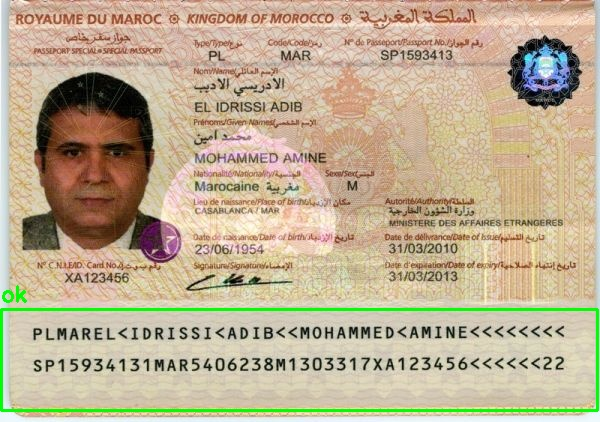

<div align="center">

# 🛂 Passport-OCR-YOLO


**YOLO ile MRZ tespiti · MRZ çözümleme · OCR ile yapılandırılmış JSON çıktısı**

Pasaport ve kimlik belgelerindeki **MRZ (Machine Readable Zone)** bölgesini YOLO ile tespit eden,
bu bölgeyi OCR ile okuyup çözümleyen ve sonuçları temiz bir **JSON** yapısına aktaran uçtan uca bir hat.

<p>
  
  
  
  
  
</p>

</div>

---

## 📌 Proje Amacı

Bu proje, pasaport ve seyahat belgelerinin görüntülerinden **otomatik veri çıkarımı** yapar:

1. **🔍 Tespit (Detection)** — YOLO modeli, belge üzerindeki **MRZ** bölgesini tespit eder ve kırpar.
2. **🧩 Çözümleme (Parsing)** — Tespit edilen MRZ satırları, ICAO 9303 formatına göre çözülerek alanlara ayrılır.
3. **🔤 OCR & Çıktı** — MRZ ve ilgili alanlar OCR ile okunur, doğrulanır ve **yapılandırılmış JSON** olarak kaydedilir.

```text
   ┌──────────┐     ┌──────────┐     ┌──────────┐     ┌──────────┐
   │  Görüntü │ ──▶ │   YOLO   │ ──▶ │   MRZ    │ ──▶ │   OCR    │ ──▶  📄 JSON
   │ (Passport)│    │ Tespiti  │     │ Çözümleme│     │ + Doğrul.│
   └──────────┘     └──────────┘     └──────────┘     └──────────┘
```

---

## ✨ Özellikler

- 🎯 **YOLO tabanlı MRZ tespiti** — pasaport/kimlik üzerindeki MRZ bölgesini hızlı ve doğru biçimde bulur.
- 🧠 **ICAO 9303 MRZ çözümleme** — TD1 / TD2 / TD3 formatlarını destekleyen alan ayrıştırma.
- 🔤 **OCR entegrasyonu** — Tesseract / EasyOCR ile metin okuma.
- ✅ **Checksum doğrulaması** — MRZ kontrol haneleriyle alan doğruluğunun denetimi.
- 📦 **Yapılandırılmış JSON çıktısı** — ülke, ad, soyad, belge kodu, belge tipi ve daha fazlası.
- 🗃️ **SQLite referans veritabanı** — ülke ve belge bilgilerinin eşleştirilmesi için.

---

## 🗂️ Proje Yapısı

```text
Passport-OCR-YOLO/
├── Images/                 # Görüntü verisi (git'e dahil değildir)
│   ├── Kimlikler/
│   └── Original Data/
│   └── MRZ Data/
│   └── Outputs/
│   └── Results/
├── SQL/
│   └── europa_data.db      # Referans veritabanı (ülke / belge bilgileri)
├── .gitignore
├── .gitattributes
└── README.md
```

> ℹ️ `Images/`, model ağırlıkları (`*.pt`, `*.onnx`) ve `runs/` çıktıları `.gitignore` ile depo dışında tutulur.

---

## 🗄️ Veritabanı Şeması

`SQL/europa_data.db` içindeki `europa_data` tablosu, çözümlenen belgelerin eşleştirilmesi ve
referans verisi için kullanılır:

| Alan          | Tip     | Açıklama                          |
|---------------|---------|----------------------------------|
| `id`          | INTEGER | Birincil anahtar                 |
| `country`     | TEXT    | Ülke                             |
| `doc_code`    | TEXT    | Belge kodu (ör. `P`, `ID`)       |
| `doc_type`    | TEXT    | Belge tipi                       |
| `Name`        | TEXT    | Ad                               |
| `Surname`     | TEXT    | Soyad                            |
| `Descriptions`| TEXT    | Açıklama                         |
| `date`        | TEXT    | Tarih                            |
| `image_path`  | TEXT    | Görüntü yolu                     |
| `source_url`  | TEXT    | Kaynak bağlantısı                |

---

## 🚀 Kurulum

```bash
# Depoyu klonlayın
git clone <repo-url>
cd Passport-OCR-YOLO

# Sanal ortam oluşturun
python -m venv .venv
# Windows
.venv\Scripts\activate
# Linux / macOS
source .venv/bin/activate

# Bağımlılıkları yükleyin
pip install -r requirements.txt
```

**Önerilen bağımlılıklar:** `ultralytics`, `opencv-python`, `pytesseract` veya `easyocr`, `numpy`, `pandas`.

> 🔧 Tesseract kullanılacaksa sistemde [Tesseract OCR](https://github.com/tesseract-ocr/tesseract) ayrıca kurulmalıdır.

---

## 🧪 Kullanım

```bash
# Tek bir görüntüyü işle
python main.py image "Images/MRZ_Data/Processed_data/images/test/2e11ec19-MAR-AS-02002_165552.jpg"

# Kameradan canlı okuma başlat
python main.py camera --index 0
```

### Örnek İşlem Sonucu



```json
{
  "status": "ok",
  "document_type": "PL",
  "issuing_country": {
    "code": "MAR",
    "name": "Morocco"
  },
  "fields": {
    "surname": "EL IDRISSI ADIB",
    "given_names": "MOHAMMEDKAMINE",
    "document_number": "SP1593413",
    "nationality": {
      "code": "MAR",
      "name": "Morocco"
    },
    "date_of_birth": {
      "raw": "540623",
      "iso": "1954-06-23"
    },
    "sex": "M",
    "date_of_expiry": {
      "raw": "130331",
      "iso": "2013-03-31"
    },
    "personal_number": "XA123456"
  },
  "validation": {
    "document_number_valid": true,
    "date_of_birth_valid": true,
    "date_of_expiry_valid": true,
    "personal_number_valid": true,
    "composite_valid": true,
    "auto_repaired_fields": []
  },
  "detection_confidence": 0.8583,
  "ocr_confidence": 0.6713,
  "overall_confidence": 0.8589,
  "raw_mrz": [
    "PLMAREL<IDRISSI<ADIB<<MOHAMMEDKAMINE<<<<<<<<",
    "SP15934131MAR5406238M1303317XA123456<<<<<<22"
  ]
}
```

---

## 🔄 İşleyiş Akışı

| Adım | Bileşen      | Görev                                                        |
|------|--------------|-------------------------------------------------------------|
| 1️⃣  | **YOLO**     | Belge görüntüsünde MRZ bölgesini tespit eder ve kırpar.     |
| 2️⃣  | **OCR**      | Kırpılan MRZ bölgesindeki karakterleri okur.                |
| 3️⃣  | **Parser**   | MRZ satırlarını ICAO 9303'e göre alanlara ayırır.           |
| 4️⃣  | **Validator**| Kontrol haneleri (checksum) ile alan doğruluğunu denetler.  |
| 5️⃣  | **Export**   | Sonuçları JSON olarak kaydeder ve veritabanıyla eşleştirir. |

---

## 🤝 Katkıda Bulunma

Katkılar memnuniyetle karşılanır! Lütfen bir `issue` açın veya `pull request` gönderin.

## 📄 Lisans

Bu proje **MIT Lisansı** ile lisanslanmıştır.
