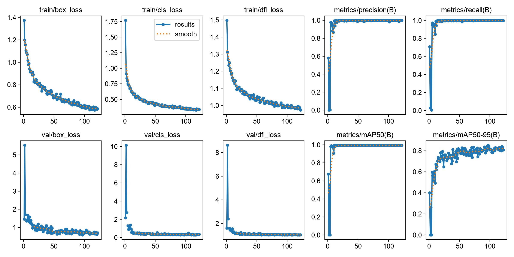
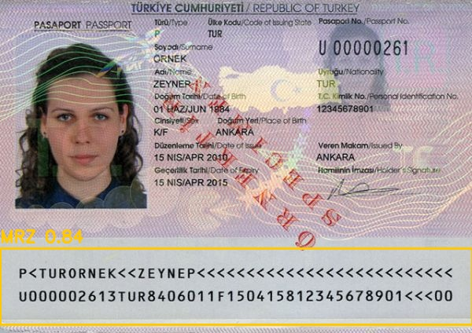

<div align="center">

# Passport-OCR-YOLO


Detect the MRZ on a passport with YOLO, read it with Tesseract + OCR-B,
and get clean, validated JSON back.

<p>
  
  
  
  
  <a href="https://deepwiki.com/Enes-Sarpun/Passport_Detection_Project"></a>
</p>

</div>

---

## What it does

The Machine Readable Zone (MRZ) is the two or three lines of monospaced text at
the bottom of a passport. This pipeline pulls the data out of it in three steps:

1. **Detect** — a YOLO model finds and crops the MRZ region.
2. **Read** — the crop is passed through Tesseract with an MRZ-specific OCR-B model.
3. **Parse** — the lines are decoded per ICAO 9303, validated against their check
   digits, and written out as JSON.

```text
   Image ──▶ YOLO ──▶ Tesseract + OCR-B ──▶ ICAO 9303 parser ──▶ JSON
```

A few things worth mentioning:

- **TD1 / TD2 / TD3** MRZ formats are all supported.
- **Check-digit validation** catches bad reads, and common OCR slips (a date digit
  read as a letter, a country code letter read as a digit) are repaired automatically.
- **Reliability score** — every result comes with a number saying how much to trust
  it. Anything below the threshold is flagged for a human to double-check.
- **Optional cloud fallback** — if a read comes out shaky, it can be re-read with
  Google Vision (off unless you set an API key).

---

## Accuracy

Measured against a hand-verified ground truth of 168 passports, run end to end
through the full pipeline:

| Metric             | Value       |
|--------------------|-------------|
| Character accuracy | 98.30%      |
| Field accuracy     | 96.94%      |
| All fields correct | 146 / 168   |

The YOLO detector's training curves — loss dropping, precision/recall/mAP climbing:



### Reliability score

Rather than hand-picked weights, the trust score is a small logistic-regression
model calibrated on the ground-truth set (out-of-fold AUC **0.915**). Reads below
the **0.75** threshold are marked `rescan_recommended` and sent to manual review —
in testing this caught every wrong read while keeping false alarms low.

---

## Getting started

```bash
git clone <repo-url>
cd Passport-OCR-YOLO

python -m venv .venv
.venv\Scripts\activate        # Windows
source .venv/bin/activate     # Linux / macOS

pip install -r requirements.txt

# One-time: fetch the OCR-B model
python main_tess.py setup
```

You'll also need [Tesseract OCR](https://github.com/tesseract-ocr/tesseract)
installed on your system (on Windows it defaults to
`C:\Program Files\Tesseract-OCR\tesseract.exe`).

To turn on the cloud fallback, set `GOOGLE_VISION_API_KEY`. Only the cropped MRZ
strip is ever sent out, and only when a read is low-confidence. Without the key
nothing changes.

---

## Usage

```bash
# Process one image
python main_tess.py image "Images/MRZ_Data/images/2dfa28dd-TUR-AO-02001_265357.jpg"

# Write the output somewhere specific
python main_tess.py image "<image path>" --output-dir "Images/Outputs"
```

Each run drops two files: an annotated image with the MRZ box drawn, and a JSON
file with the parsed data.



Every field carries its own `reliability`, and the document gets an overall
`quality.reliability_score`:

```json
{
  "document": {
    "type": { "code": "P", "description": "Passport" },
    "number": { "value": "ZD000078", "reliability": 0.95 },
    "personal_number": { "value": "00000000000", "reliability": 0.95 },
    "mrz_format": "TD3"
  },
  "holder": {
    "surname": { "value": "MARTIN", "reliability": 0.89 },
    "given_names": { "value": "SARAH", "reliability": 0.89 },
    "given_names_list": ["SARAH"],
    "full_name": "SARAH MARTIN",
    "nationality": { "code": "CAN", "name": "Canada", "reliability": 0.97 },
    "sex": { "code": "F", "description": "Female", "reliability": 0.95 }
  },
  "dates": {
    "date_of_birth": { "raw": "850101", "iso": "1985-01-01", "reliability": 0.97 },
    "date_of_expiry": { "raw": "180114", "iso": "2018-01-14", "reliability": 0.96 },
    "is_expired": true
  },
  "validation": {
    "mrz_overall_valid": true,
    "failed_checks": [],
    "auto_repaired_fields": []
  },
  "quality": {
    "reliability_score": 0.92,
    "rescan_recommended": false
  },
  "warnings": ["document_expired"],
  "raw_mrz": [
    "P<CANMARTIN<<SARAH<<<<<<<<<<<<<<<<<<<<<<<<<<",
    "ZD000078<7CAN8501019F1801145<<<<<<<<<<<<<<04"
  ]
}
```

---

## Project layout

```text
Scripts/
  detection/    # YOLO detection + image preprocessing
  ocr/          # Tesseract + OCR-B engine and the main pipeline
  parsing/      # ICAO 9303 parsing, check-digit repair, JSON schema
  YOLO/         # model weights + training notebook
GroundTruth/    # hand-verified ground truth + accuracy/calibration tools
tests/          # MRZ parsing tests
SQL/            # SQLite reference database (country / document info)
main_tess.py    # CLI entry point
```

`Images/`, model weights (`*.pt`, `*.onnx`), and training runs are kept out of
the repo.

---

## Contributing

Issues and pull requests are welcome.

## License

MIT.
